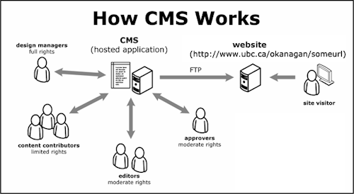

# Qu’est-ce qu’un gestionnaire de contenu ?



## Le problème

La plupart des sites Web que vous avez conçus jusqu’à présent dans le cadre de votre formation ont été programmés manuellement à l’aide des langages de base du Web : HTML, CSS et Javascript. Pour des site Web de petite envergure, ces technologies sont amplement suffisantes, mais dès qu’un projet gagne en ambition, deux problèmes apparaissent :

**Plus un site Web a de contenu, plus il est fastidieux à concevoir et à gérer.** Imaginez un site Web qui possède une centaine d’articles ; il est certes possible de le programmer directement en HTML et en CSS, mais ce serait très long. Et dès qu’un changement est nécessaire, il faudrait changer le balisage de cent pages, une à la fois.

**D’autres gens que vous doivent pouvoir éditer et ajouter du contenu.** Peut-être pourriez-vous leur apprendre à écrire du HTML, mais c’est rarement une (bonne) option. Après tout, un fichier HTML n’est peut-être pas le meilleur endroit pour écrire un long article, ou ajouter le tout nouveau produit de votre site marchand.

## La solution

La solution à ces problèmes consiste à introduire un niveau d’abstraction. Plus précisément, il s’agit d’abstraire le *contenu* du site Web de son *balisage* afin de pouvoir travailler sur chacun séparément. De cette façon, le ou la programmeur·se peut concevoir le site Web sans avoir à s’occuper directement du contenu, et les responsables du contenu peuvent créer celui-sans sans avoir à s’occuper directement du code.

Pour ce faire, on fera les trois choses suivantes :

1. Extraire le contenu (concrètement, le texte et les images) des fichiers HTML, et le stocker dans un endroit séparé : une base de données, ou tout autre format de représentation de données.
2. Concevoir des *gabarits*, soit des modèles de nos fichiers HTML où le contenu est remplacé par une représentation abstraite de celui-ci.
3. Mettre en place un programme qui ingère le contenu et les gabarits, puis les combine pour en faire des fichiers HTML standards.

La combinaison de ces trois choses est ce qu’on appelle un système de gestion de contenu (*content management system* ou CMS en anglais). Certains gestionnaires ont encore plus de fonctionnalités, comme une interface Web à travers laquelle il est possible d’ajouter et de modifier des pages, la personnalisations de thèmes ou l’hébergement Web, mais l’idée centrale reste la même : l’abstraction du contenu.

## Types de gestionnaires

**Traditionnel** — Un gestionnaire de contenu traditionnel tel que [Wordpress](https://wordpress.org), [Drupal](https://www.drupal.org) ou [Ghost](https://ghost.org) est dit couplé car il lie un *back-end*, un *front-end*, et une interface de gestion de contenu. Il comprend tout ce qui est nécessaire pour la création d’un site Web. Il requiert d’être installé sur un serveur et, une fois installé, maintenu.

**SaaS** — Un gestionnaire de contenu dit « SaaS » (*software as a service*) ressemble à un gestionnaire de contenu traditionnel en ce qu’il comprend également tout ce qui est nécessaire pour la création d’un site Web. À la différence de ce dernier, un gestionnaire de contenu SaaS est cependant hébergé dans les « nuages ». Il ne nécessite pas d’être installé, et ne requiert aucune configuration. [Squarespace](https://www.squarespace.com), [Shopify](https://www.shopify.com/ca) ou [Webflow](https://webflow.com) sont de bons exemples de ce type de service.

**Découplé** — Un gestionnaire de contenu découplé (en anglais, *headless*) fournit seulement un *back-end*. Il contient une interface pour gérer le contenu du site Web, mais ne s’occupe pas d’afficher ledit contenu. Une fois stockées, les données sont généralement disponibles à travers une API qui peut être traitée séparément. [Contentful](https://www.contentful.com) ou [Strapi](https://strapi.io) sont des exemples de gestionnaires de contenu découplés, mais n’importe quelle application Web possédant une API peut fonctionner comme tel : [Google Sheets](https://www.google.ca/sheets/about/), [Notion](https://www.notion.so), [Airtable](https://www.airtable.com), etc. Beaucoup de gestionnaires de contenu traditionnels comme [Kirby](https://kql.getkirby.com) peuvent également être configurés pour être découplés.

Les raisons pour et contre chacun de ses types de gestionnaire de contenu sont multiples. Un gestionnaire traditionnel offre beaucoup de contrôle, mais également beaucoup de responsabilités. Un gestionnaire SaaS est simple à mettre sur pied, mais est généralement plus dispendieux, et ne permet pas autant de personnalisation. Un gestionnaire découplé permet de desservir plusieurs *front-ends*, et offre une meilleure séparation des préoccupations, mais engendre des complexités supplémentaires.

## Moteur de gabarit

La plupart des générateur de sites statiques utilisent un moteur de gabarit : un outil qui permet d’abstraire la structure des documents HTML, et ainsi simplifier leur création. Ces moteurs utilisent des langages de programmation « simplifiés » tel que PHP, Jinja ou Liquid, lesquels permettent de décrire le *modèle* de la page sans manipuler directement ses données.

Par exemple, voici à quoi ressemble une navigation écrite avec le language [Nunjucks](https://mozilla.github.io/nunjucks/) :

```html
<nav>
	<ul>
		
			<li>
				<a href="{{ navItem.url }}">
					{{ navItem.name }}
				</a>
			</li>
		
	</ul>
</nav>
```

Lors de la compilation du site Web, le moteur de gabarit remplace les variables par les valeurs appropriées, et génère une page HTML. 

Ainsi, étant donné les données ci-dessous :

```json
{
	"navItems": [
		{
			"name": "Home",
			"url": "/"
		},
		{
			"name": "About",
			"url": "/about"
		},
		{
			"name": "Projects",
			"url": "/projects"
		},
	]
}
```

le résultat est le suivant : 

```html
<nav>
	<ul>
		<li><a href="/">Home</a></li>
		<li><a href="/about">About</a></li>
		<li><a href="/projects">Projects</a></li>
	</ul>
</nav>
```

## 4. Ressources

-   [Oracle : _What is a content management system (CMS)?_](https://www.oracle.com/ca-en/content-management/what-is-cms/)
-   [Luke Vnenchak : _Scoop: A Glimpse Into the NYTimes CMS_](https://open.nytimes.com/scoop-a-glimpse-into-the-nytimes-cms-ae54b266d018)
-   [Max Kohler : _What’s a Content Management System?_](https://www.maxkohler.com/posts/2021-11-20-whats-a-cms/)
